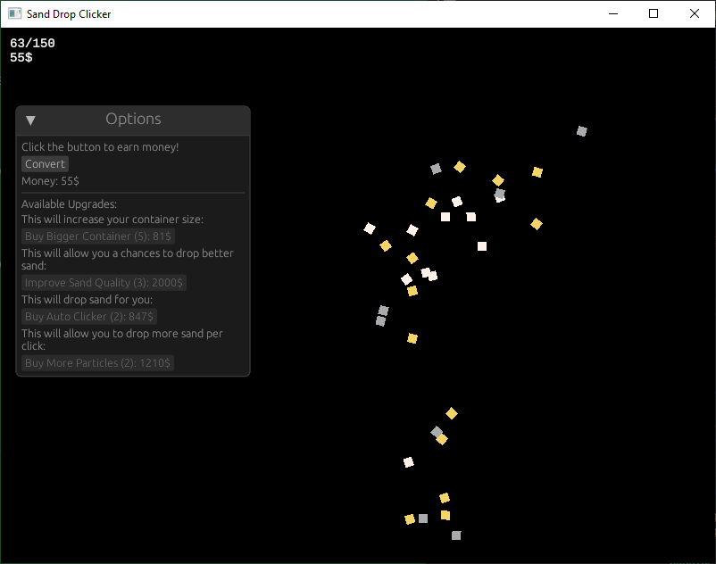

# What Is This?

## Sand Drop Clicker
Based on the project name, you can already get an idea of what it's about, but I’ll thoroughly explain it to ensure no detail is missed. Sand Drop Clicker is a game about dropping sand into a container, where the amount of sand dropped depends on the number of clicks the user makes. Grains of sand can be exchanged for currency, but the amount of sand sold cannot exceed the player's container size. The game will provide the user with upgrades in exchange for currency, which will be in dollars ($). These upgrades will range from the types of consumers of sand to personal upgrades, like the container sizes. Another interesting aspect of the program is that there will be an end goal, which is uncommon in many clicking games. The end goal will involve reaching 1 billion dollars, becoming the world’s greatest sand salesman. The end goal won’t reset your progress, so you’ll be able to gain even more wealth. 

## How to Play?

- Click to drop sand - each click drops a grain into the container.
- Sell sand for money - you can only sell as much as your container holds.
- Upgrades - buying upgrades will help you reach your goal faster.
- Doesn't need a web browser to interact; this program runs on its own application.

Note: Use __ctr-i__ to view additional information about the game, and hit __ctr-q__ to quit it.



## Who am I? And Why?

Hello my name is __Artem__ and I (In this moment of time) am a student at __Portland State University__. This program is a term project for my Rust Programming Language class (CS423 for those interested). Hopefully, this program will be used to show how well I understand the language and if I know what I'm doing (please have mercy). 

## How The Program Works

This program runs on its own desktop window, so no need for a browser. 

The program uses __five__ specific Rust crates:

- GGEZ - a lightweight 2D game framework
- GGEGUI - a GUI layer for ggez
- RAND - randomized grain drops
- STRUM
- STRUM_MACROS - helpful for iterating through enums, for cleaner logic

#### GGEZ & GGEGUI:

The GGEZ library is a lightweight game framework used for making 2D games. This crate handles the game logic and looping. The GGEGUI crate is an implementation of egui (another Rust crate) for GGEZ, which provides a simple and fast GUI. This handles the 'option' menu within the game.

#### RAND

The rand crate is for generating random numbers, which are used within the game whenever multiple grains are dropped. 

#### STRUM & STRUM_MACROS

This crate was used for enum iteration, which helped in reducing the amount of work needed to implement my own system, but also made it more automated in case I wish to add more upgrades. 

## How To Run The Program

```sh
git clone https://github.com/Artemsuprun/Sand-Drop-Clicker.git
cd ./path/to/Sand-Drop-Clicker/
cargo run
```

## Lessons Learned

### Things That Didn't Work Out:

- Web version

I couldn't implement the original game into a web interface as I originally planned, since I realized that it would be incredibly easy to manipulate the program and make the player win. While I could have just ignored it, the security side in me just couldn't live with it being easily broken into. So, I made the game into its own application, where it would be a bit more difficult to manipulate the game results. 

- Saving progress

Another aspect of the game that I had planned but didn't work out was the ability to save the progress of the game. While I could still implement it, I'm running a bit low on time and need to make a working project right now! This is something I could do for my future work if I ever plan to go back into this program.

- Final goal feature

Finally, the last thing I wasn't able to implement was a game finish where the user wins after gaining 1 billion dollars. The reasoning is the same for the previous one, but I just didn't have the time to implement it without making the entire program look even more jankier than it already is.

### What I learned:

I learned a lot in this project! I especially learned how to program in Rust, which was the main goal of the project. Other things I've learned as I was programming were game mechanisms (like the game loop), how meshes for graphics work, green-threads, and handling timed events.
